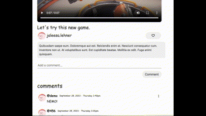

## FunTube

FunTube is a YouTube clone project, which is a video-sharing platform that allows users to discover, upload, and watch different kinds of videos covering different categories. FunTube offers interactive features such as video comments and favorites.

##  Live Site

[FunTube](https://funtube-web-service.onrender.com)

## Technologies, Libraries, APIs

This project is a Full Stack Project that is implemented with the following technologies:

*   Ruby on rails as backend
*   React as frontend
*   Bootstrap as part of the CSS styling
*   Npm to manage project dependencies
*   Webpack to bundle the source JavaScript code

##  Features

*   User Auth: User can sign up, sign in, and log out. Users can use a demo login to try the site. Users can't make comments or like videos without logging in.
*   Videos: User can see a list of videos on the homepage and search videos by video title. User can add comments and likes on videos.
*   Favorites: Login user can like/dislike videos. User can have a favorite page to see all the videos they like.
*   Comments: Login user can add comments to videos. Users can edit and delete their own comments.
  
-   The comment create, edit, and delete:

  

*   Channel: Users can have their channel as a personal profile to organize their uploaded videos. Users can customize their channel.

##  Future Features
- Add upload and edit feature to the videos
- Add comment feature to the comments
- Add recommended video list to video show page